# 📊 Excel-21

## ✨ Project Description

**Excel-21** is your illustrated guide to the Analysis ToolPak in Microsoft Excel, complete with screenshots and step-by-step instructions for:
- Histogram
- Descriptive Statistics
- Moving Average
- Exponential Smoothing
- Correlation Analysis
- Regression Analysis

> 📚 **Goal:** Help you analyze data efficiently in Excel—ideal for learners and professionals!

---

## 📒 Table of Contents

- [Analysis ToolPak Setup](#-analysis-toolpak-setup)
- [Histogram](#-histogram)
- [Descriptive Statistics](#-descriptive-statistics)
- [Moving Average](#-moving-average)
- [Exponential Smoothing](#-exponential-smoothing)
- [Correlation Analysis](#-correlation-analysis)
- [Regression Analysis](#-regression-analysis)
- [Screenshots](#-screenshots)
- [Requirements](#-requirements)
- [Author](#-author)

---

## ⚙️ Analysis ToolPak Setup

The Analysis ToolPak is an Excel add-in providing data analysis tools for financial, statistical, and engineering tasks.

1. On the **File** tab, click **Options**.
2. Under **Add-ins**, select **Analysis ToolPak** and click **Go**.
   
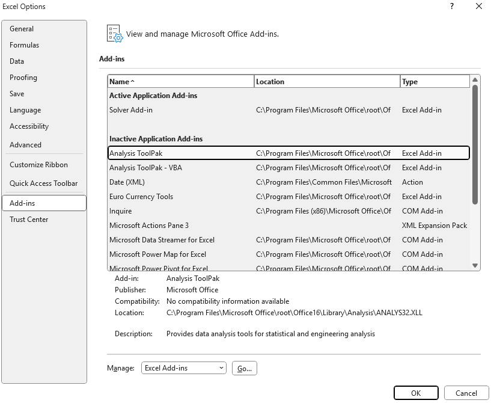
   
3. Check **Analysis ToolPak** and click **OK**.
   
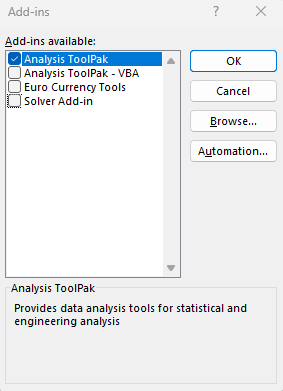
   
4. On the **Data** tab, in the **Analysis** group, you can now click **Data Analysis**.
   
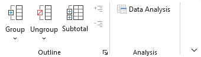

---

## 📊 Histogram

1. Enter bin numbers (upper levels) in the range `C4:C8`.
2. Go to **Data** tab → **Data Analysis**.
3. Select **Histogram** and click **OK**.

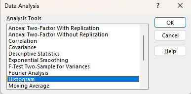
   
4. Select your data range (`A2:A20`), bin range (`C4:C8`), and output range (`F6`). Check **Chart Output**.
   
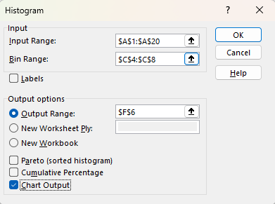
   
5. Click **OK**.
   
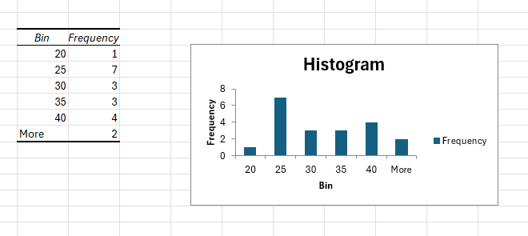
   
6. Click the legend and press Delete. Label bins clearly.
7. To remove the space between bars: right-click a bar → **Format Data Series** → set **Gap Width** to 0%.
8. To add borders: right-click bar → **Format Data Series** → **Fill & Line** icon → **Border** → select color.
    
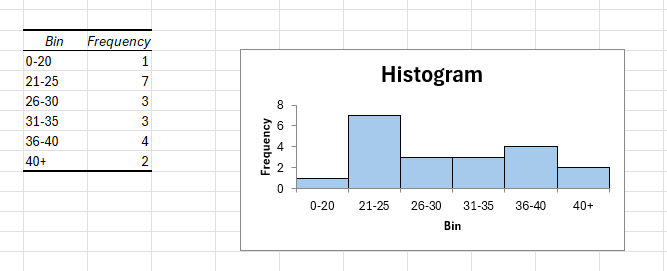

> 🎨 *Note: Color changed for clarity. If using Excel 2016+, you can use the built-in Histogram chart type.*

---

## 📑 Descriptive Statistics

Generate summary statistics using the add-in:

1. Go to **Data** tab → **Data Analysis**.
2. Select **Descriptive Statistics** and click **OK**.
   
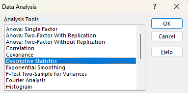
   
3. Input range: `A1:A15`, Output range: `C4`, check **Summary statistics**.
   
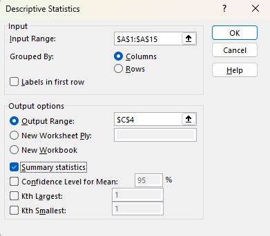
   
4. Click **OK**.
   
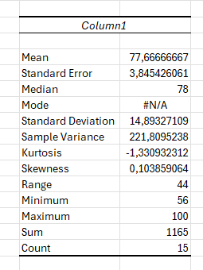

---

## 📈 Moving Average

Moving averages smooth out peaks and valleys to reveal trends.

1. Go to **Data** tab → **Data Analysis**.
2. Select **Moving Average** and click **OK**.
   
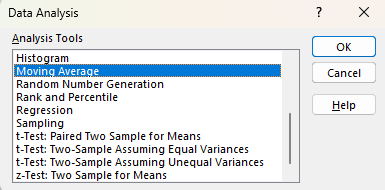
   
3. Input range: `B2:M2`, Interval: `6`, Output range: `B3`.
4. Click **OK**.
   
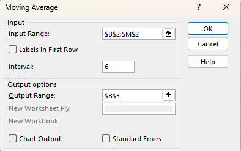
   
5. Repeat with intervals `2` and `4`, then plot the graph.
    
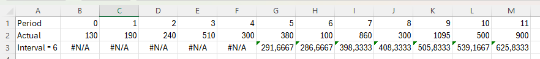
   
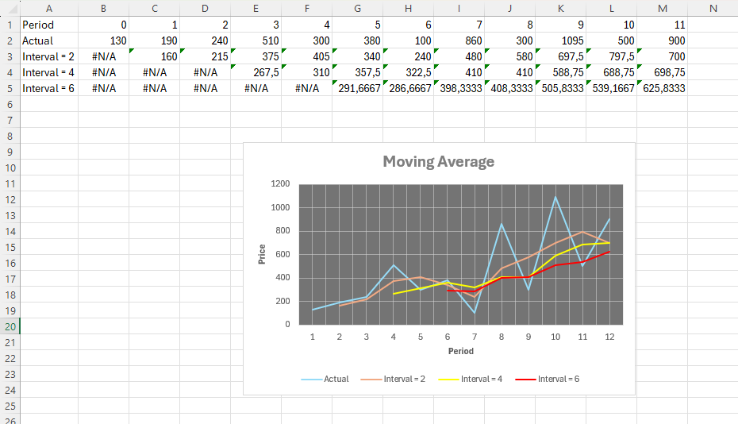

> 📌 *Conclusion: Larger intervals smooth more, smaller intervals are closer to actual data.*

---

## 📉 Exponential Smoothing

Another way to highlight trends:

1. Go to **Data** tab → **Data Analysis**.
2. Select **Exponential Smoothing** and click **OK**.
   
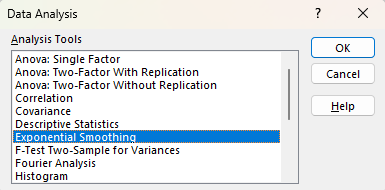
   
3. Input range: `B2:M2`, Damping factor: `0.9` (1-α), Output range: `B3`.
4. Click **OK**.
   
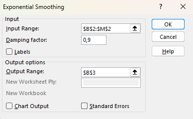

5. Repeat for α = `0.3` and α = `0.8`, then plot the graph.
   
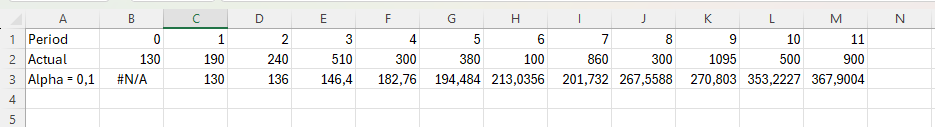
   
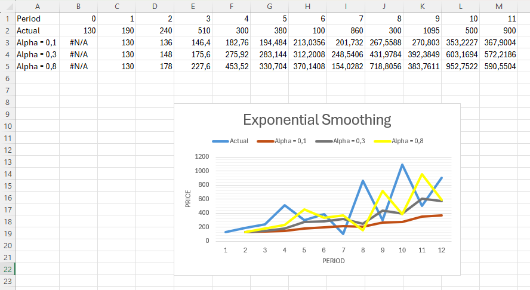

> 📌 *Conclusion: Smaller α (larger damping) means smoother lines.*

---

## 🔗 Correlation Analysis

The correlation coefficient measures how strongly variables relate.

1. Go to **Data** tab → **Data Analysis**.
2. Select **Correlation** and click **OK**.
   
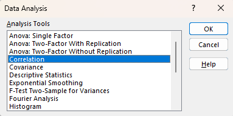
   
3. Input range: `A1:C6`, check **Labels in first row**, Output range: `A8`.
4. Click **OK**.
   
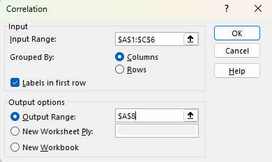
   
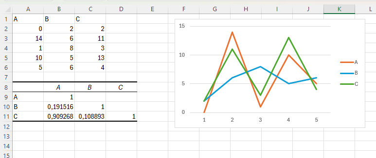

> ℹ️ *Variables A and C are positively correlated (0.91); A and B, B and C are weakly correlated.*

---

## 📉 Regression Analysis

Test relationships between Quantity Sold and inputs like Price/Advertising.

1. Go to **Data** tab → **Data Analysis**.
2. Select **Regression** and click **OK**.
   
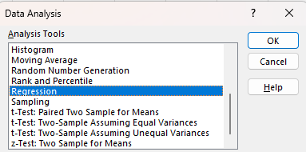
   
3. Y Range: `A1:A8` (dependent), X Range: `B1:C8` (independent), check **Labels** and **Residuals**. Output range: `A11`.
4. Click **OK**.
   
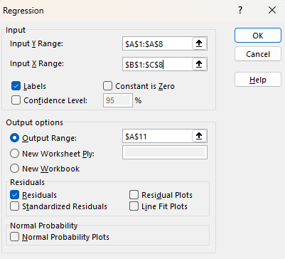
   
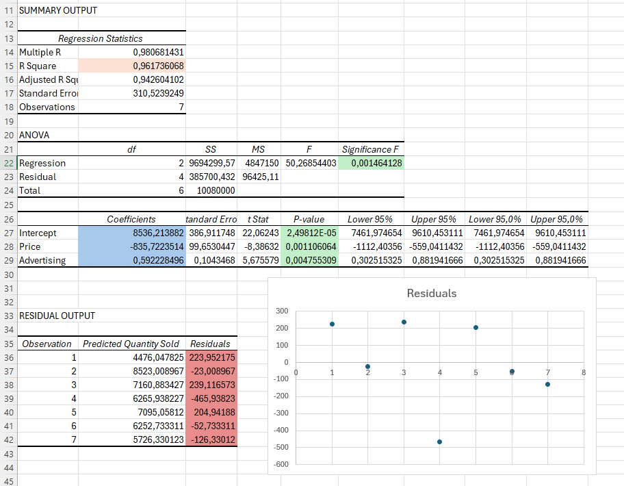

> ✅ *R Square = 0.962 (excellent fit). Significance F < 0.05 and all P-values < 0.05, so results are statistically significant.*

**Regression equation:**  
`y = Quantity Sold = 8536.214 - 835.722 * Price + 0.592 * Advertising`

---

## 📷 Screenshots

All screenshots are in the `/Screenshots` folder.

---

## ℹ️ Requirements

- Microsoft Excel (recommended: 2021/365)
- Windows OS

---

## 👨‍💻 Author

Project and documentation by **Kuba27x**  
Repository: [Kuba27x/Excel-21](https://github.com/Kuba27x/Excel-21)

---
